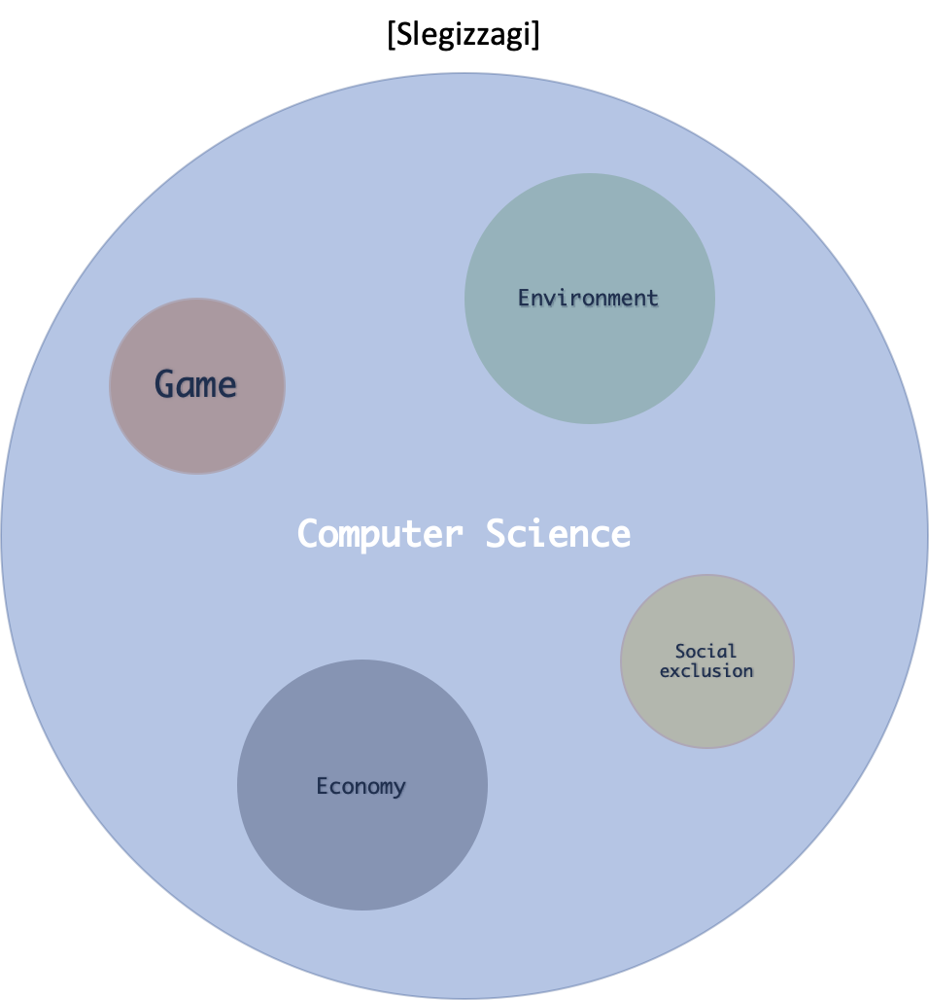

# 20-1 학기 슬기짜기

---

> 안녕하세요 20-1학기 슬기짜기 회장 전상규 입니다. 이번학기도 한번 슬기롭게 짜보죠!

## 슬기짜기란.

*  슬기짜기는 1995년, 학교 개교 이후 기계제어시스템공학부 / 전산전자공학부 학생들이 주축이 되어 만들어졌습니다.

* 슬기짜기는 외래어인 컴퓨터를 순 우리말로 풀어 '슬기셈틀'이라고 합니다. '짜다'는 생각을 구상하고 계획한다는 의미입니다. "슬기 셈틀"과 "짜다"를 합성하여 슬기짜기가 탄생하였습니다.

* 슬기짜기는 Computer Science라는 학문을 중심으로 여러 다른 분야와  **융합**하여 프로젝트를 진행하는 동아리 입니다.

  

  

## 활동

> * 2020년 1학기 부터는, 슬기짜기에서는 모두가 본인이 원하는 프로젝트에 속해 있어야 합니다. 개인의 활동으로는 프로젝트를 성장 시키고, 단체 활동에서는 그러한 성장을 다른 사람들에게 나눠주는 역할을 하게 됩니다.
>
> * 다음은 각각, 슬기짜기 일원으로서 개인과 단체에 대한 활동입니다. 

### 개인 활동

* 프로젝트에 속하여 설계 및 건설하기.
* 한 학기 최소 1회 세미나 진행

### 단체

* MT 및 OT
* 동아리 BBQ
* 동아리 정모 세미나 참여
* 임원 선거
* 방학 프로젝트 (Option)

## 프로젝트

> * :sailboat: 프로젝트는 한 척의 배가 넓은 바다를 항해하는 것과 같습니다. 배에 탄 crew들은 모두 자신들의 role을 통헤 배가 큰 차질 없이 목적지에 도착하는 것입니다.
> * Role은 프로젝트에 따라 세분화 혹은 수정이 충분히 가능합니다.

### Role

* **:telescope: 기획자:** 프로젝트의 3가지 요소를 정한다. 시작점(start), 종착점(end), 마디점(node).
* **:anchor: 개발자:** 프로젝트에서 마디점을 연결하는 역할을 한다
* **:sparkles: 디자이너:** 프로젝트의 시작점, 종착점 그리고 마디점들을 알맞게 색칠하는 역할을 한다.

### [프로젝트 List](https://github.com/HGU-slegizzagi/20-1/tree/master/project)

* [Slegizzagi Tech Blog 개설](./)
* [공모전 출전](./)
* [알고리즘 Practice](./)

## 20년도 1학기 계획

### 주차 별

| 주차                               | 내용                                 |
| ---------------------------------- | ------------------------------------ |
| 1 주차                             | 기존 멤버 설문 조사 & Proejct 등록   |
| 2 주차                             | Recruiting Week                      |
| 3 주차                             | Project 등록 마감 & Recruiting Week  |
| 4 주차                             | Recruiting End & Slegizzagi Kick Off |
| 5 주차                             | OT (Orientation)                     |
| 6 주차                             | sleCS01(세미나) + Project Meeting    |
| 7 주차                             | sleCS01 + Project Meeting            |
| 8 주차  | 중간 고사: ~~Week Off~~              |
| 9 주차                             | Late MT or BBQ                       |
| 10 주차                            | sleCS01 + Project Meeting            |
| 11 주차                            | sleCS01 + Project Meeting            |
| 12 주차                            | sleCS01 + Project Meeting            |
| 13 주 차                           | sleCS01 + Project Meeting            |
| 14 주차                            | :tada: ​Slegizzagi Party :pizza: ​​     |
| 15 주차                            | ~~Week Off~~                         |
| 16 주차 | 기말 고사: ~~Wee Off~~               |
| 17 주차~                           | Summer Project Start                 |

## 운영 방침

